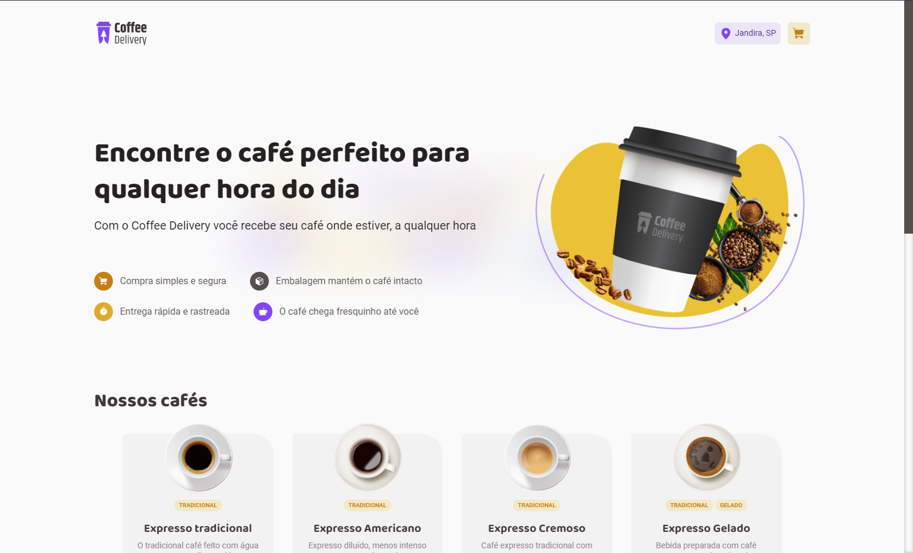
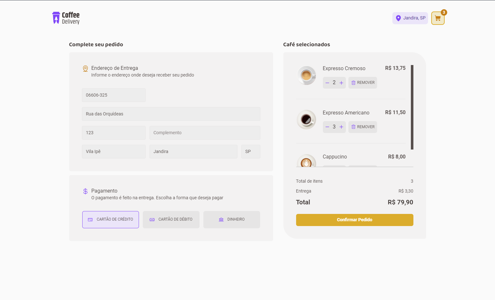
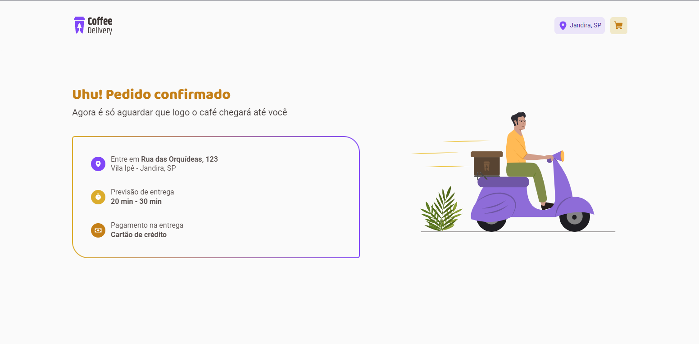

# Githublog

Coffee E-commerce built with ReactJS using Vite and npm. This project for personal studies and to accomplish the Rocketseat Ignite Challenge. Here you'll find features like CEP Automation, Animations and Micro Interations besides the fast and responsive web pages.

## Status

Finished 🚀

## Preview

## Stack

- React
- Typescript
- React-Hook-Form
- react-router
- @tanstack/react-query
- styled-components
- dayjs
- axios
- zod
- react-toastify
- use-sound
- framer-motion
- @phosphor-icons

## Contributors

## Author

<b>Victor Silva</b>🚀

